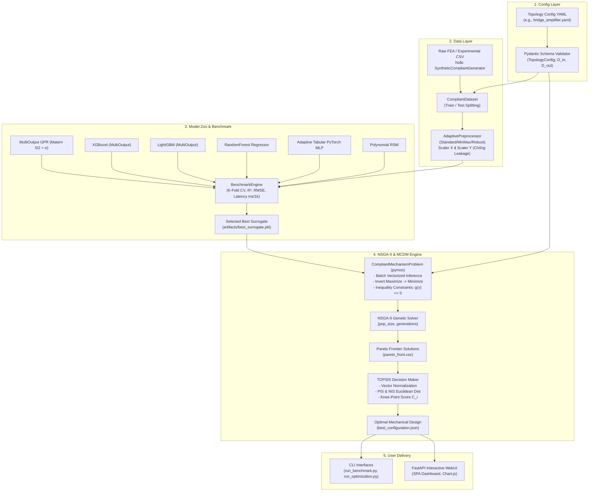

# AutoCompliant-ML: Technical Architecture & System Operational Report

**Phiên bản tài liệu:** 1.0  
**Tác giả:** Lead System Architect  
**Hệ thống:** AutoCompliant-ML (Machine Learning Pipeline & Multi-Objective NSGA-II Optimization for Compliant Mechanisms)  
**Ngày phát hành:** Tháng 10/2026  

---

## 1. Tổng quan Luồng Vận hành (End-to-End Pipeline Workflow)

### 1.1. Sơ đồ Luồng Dữ liệu (Dataflow Architecture)

Hệ thống **AutoCompliant-ML** được thiết kế theo kiến trúc Config-Driven khép kín. Toàn bộ các module toán học, tiền xử lý, mô hình học máy và giải thuật tiến hóa đều tự thích ứng mà không phụ thuộc cứng (hard-code) vào bất kỳ cơ cấu cơ học cụ thể nào.



### 1.2. Nguyên lý Thích ứng Tự động Số chiều $(D_{\text{in}}, D_{\text{out}})$

Hệ thống tự động đồng bộ chiều dữ liệu thông qua cơ chế phản xạ cấu hình (Configuration Reflection):
1. **Dynamic Parameter Resolution**: Khi đọc file cấu hình YAML, lớp `TopologyConfig` tự động xác định $D_{\text{in}} = \text{len}(\text{inputs})$ và $D_{\text{out}} = \text{len}(\text{outputs})$.
2. **Auto Column Mapping**: Các tên cột đầu vào (`input_names`) và mục tiêu (`output_names`) được đối chiếu trực tiếp với DataFrame tải vào, kiểm tra thứ tự và dải biên $[x_i^{\min}, x_i^{\max}]$ mà không cần người dùng viết lại code nạp dữ liệu.
3. **Adaptive Layer Scaling**:
   - `AdaptivePreprocessor`: Khởi tạo `scaler_x` khớp với ma trận $(N, D_{\text{in}})$ và `scaler_y` khớp với $(N, D_{\text{out}})$.
   - `MultiOutputGPR`: Tự động khởi tạo $D_{\text{out}}$ bộ ước lượng Gaussian Process độc lập, mỗi bộ có nhân Matern với $D_{\text{in}}$ chiều độ dài tỷ lệ `length_scale`.
   - `TabularMLPNet`: Lớp đầu vào tự động gán `nn.Linear(D_in, hidden_dim)` và lớp đầu ra gán `nn.Linear(hidden_dim, D_out)`.
   - `CompliantMechanismProblem`: Không gian tìm kiếm cá thể của pymoo tự động đặt `n_var = D_in`, chặn biên dưới `xl = lower_bounds` và biên trên `xu = upper_bounds`.

---

## 2. Cơ chế Hoạt động Chi tiết Từng Module (Component Deep-Dive)

### 2.1. Config Layer (`autocompliant/config`)
Module chịu trách nhiệm định nghĩa schema kiểm thực kiểu dữ liệu nghiêm ngặt bằng **Pydantic v2**:
- **`InputParam`**:
  - Quản lý tên biến (`name`), ký hiệu toán học (`symbol`), đơn vị đo (`unit`).
  - Bộ kiểm định `@model_validator(mode="after")` tự động chặn lỗi logic: cưỡng chế điều kiện $x_{\min} < x_{\max}$. Nếu $x_{\min} \ge x_{\max}$, hệ thống lập tức ném ngoại lệ `ValueError`.
- **`OutputParam`**:
  - Hướng tối ưu hóa: Cưỡng chế kiểu `Literal["maximize", "minimize"]`.
  - Ràng buộc bất đẳng thức: Chứa `constraint_min` (ví dụ: Hệ số an toàn tĩnh $F_1 \ge 1.5$) và `constraint_max`.
- **`TopologyConfig`**:
  - Tính toán thuộc tính vector hóa `bounds`, xuất ra cặp tuple `(lower_bounds, upper_bounds)` dạng `numpy.ndarray` 64-bit chuẩn bị trực tiếp cho bộ giải thuật tiến hóa.

### 2.2. Data Layer (`autocompliant/data`)
- **`AdaptivePreprocessor` & Cơ chế Chống Rò rỉ Dữ liệu (No Data Leakage)**:
  - Tách bạch hoàn toàn `scaler_x` và `scaler_y`. Không bao giờ chuẩn hóa chung ma trận ghép $[X, Y]$.
  - Nguyên tắc vàng: Chỉ gọi `fit(X_train, Y_train)`. Dữ liệu kiểm thử $X_{\text{test}}, Y_{\text{test}}$ chỉ được phép đi qua `transform_x` và `transform_y` bằng các tham số thống kê ($\mu, \sigma$ hoặc $\min, \max$) đã học từ tập huấn luyện.
  - Cung cấp phương thức `inverse_transform_y`: Khôi phục chuẩn xác phản ứng cơ học dự báo từ không gian chuẩn hóa về đơn vị vật lý thực tế ($\mu\text{m}$, $\text{MPa}$, $\text{Hz}$) để phục vụ tính hàm phạt và hiển thị.
- **`SyntheticCompliantGenerator`**:
  - Tích hợp công thức giải tích cơ học bản lề mềm (Circular Flexure Hinge - theo nguyên lý Paros & Weisbord):
    $$\text{Độ khuếch đại hình học: } A_{\text{amp}} = \frac{1}{\tan(\theta)} \times \eta_{\text{compliance}}(t, l)$$
    $$\text{Ứng suất Von-Mises: } \sigma_{\text{max}} = K_t \cdot \sigma_{\text{nominal}}, \quad K_t = 1.0 + 0.85\sqrt{\frac{t}{r}}$$
    $$\text{Hệ số an toàn: } F_1 = \frac{\sigma_{\text{yield}}}{\sigma_{\text{max}}}, \quad \text{Tần số riêng bậc 1: } f = 420 + 1350\sqrt{\frac{K_{\text{eff}}}{M_{\text{eff}}}}$$

### 2.3. Model Zoo (`autocompliant/models`)
Tất cả mô hình đều kế thừa giao diện chuẩn `BaseSurrogateModel`, đảm bảo tính đa hình (polymorphism):
- **`MultiOutputGPR` (Gaussian Process Regression / Kriging)**:
  - Khởi tạo $D_{\text{out}}$ mô hình GPR độc lập với hàm nhân hỗn hợp:
    $$k(x, x') = \sigma_0^2 \cdot \text{Matérn}_{\nu=2.5}(x, x' \mid l_1, \dots, l_{D_{\text{in}}}) + \sigma_{\text{noise}}^2$$
  - Hỗ trợ Bayesian Uncertainty Quantification: Phương thức `predict_with_uncertainty(X)` trả về đồng thời giá trị kỳ vọng $\mu(X)$ và độ lệch chuẩn dự báo $\sigma(X)$.
- **`XGBoostSurrogate` & `LightGBMSurrogate`**:
  - Tận dụng `sklearn.multioutput.MultiOutputRegressor` để huấn luyện song song $D_{\text{out}}$ cây quyết định tăng cường độ dốc (Gradient Boosted Trees).
- **`AdaptiveMLPSurrogate` (Deep Neural Network PyTorch)**:
  - Kiến trúc Tabular Residual MLP: 
    $$h_0 = \text{SiLU}(\text{LayerNorm}(\text{Linear}(D_{\text{in}} \to 64)))$$
    $$h_1 = \text{SiLU}(h_0 + \text{ResBlock}(h_0))$$
    $$\hat{Y} = \text{Linear}(64 \to D_{\text{out}})$$
  - Sử dụng bộ tối ưu `AdamW` kết hợp `CosineAnnealingLR` scheduler giúp hội tụ ổn định trên tập dữ liệu bảng tham số hình học.

### 2.4. Evaluation Engine (`autocompliant/evaluation`)
- **Chiến lược Thẩm định**:
  - Phân tách $80/20$ Train/Test độc lập.
  - Áp dụng $K$-Fold Cross Validation ($K=5$) trên tập Train để đo lường độ ổn định $(\mu \pm \sigma)$.
- **Hệ chỉ số Toàn diện**:
  - $R^2$ Score (Hệ số xác định tổng thể và từng chiều): Càng gần 1.0 mô hình càng chính xác.
  - RMSE (Căn bậc hai sai số bình phương trung bình) & MAE (Sai số tuyệt đối trung bình).
  - MAPE (Mean Absolute Percentage Error - Sai số phần trăm tương đối).
- **Đo Độ trễ Suy luận (Latency)**:
  - Thực hiện dự báo lặp trên lô chuẩn $N = 1,000$ mẫu thiết kế, ghi nhận thời gian tính toán trung bình theo mili-giây (ms/1k inferences).
- **Xếp hạng Leaderboard**:
  - Mô hình được xếp hạng ưu tiên theo $R^2$ kiểm thử trung bình (Test $R^2$). Mô hình đứng đầu (Rank 1) tự động được lưu trữ thành file nhị phân `best_surrogate.pkl`.

### 2.5. Optimization & MCDM Engine (`autocompliant/optimization`)
- **Cầu nối `pymoo.core.problem.Problem` & Surrogate Vectorization**:
  - Bài toán di truyền cần đánh giá hàng vạn cá thể qua các thế hệ. `CompliantMechanismProblem._evaluate` đưa toàn bộ ma trận quần thể $X \in \mathbb{R}^{\text{pop\_size} \times D_{\text{in}}}$ qua `preprocessor.transform_x` $\rightarrow$ `surrogate.predict` $\rightarrow$ `preprocessor.inverse_transform_y`. Quá trình này diễn ra theo mẻ (batch) trong chỉ vài mili-giây, nhanh hơn hàng nghìn lần so với chạy mô phỏng FEA truyền thống.
- **Quy chuẩn Cực tiểu hóa của Pymoo**:
  - Pymoo mặc định giải bài toán cực tiểu hóa. Đối với các hàm mục tiêu thiết kế yêu cầu cực đại hóa (`maximize`), hàm mục tiêu được nghịch đảo dấu:
    $$\min F_j(X) = - Y_j(X)$$
- **Xử lý Ràng buộc Bất đẳng thức $g(X) \le 0$**:
  - Ràng buộc giá trị tối thiểu (ví dụ: Hệ số an toàn $F_1 \ge S_{\min} = 1.5$):
    $$g_1(X) = S_{\min} - Y_1(X) \le 0$$
  - Ràng buộc giá trị tối đa ($Y_j \le Y_{\max}$):
    $$g_2(X) = Y_j(X) - Y_{\max} \le 0$$
- **Thuật toán Ra quyết định TOPSIS (Technique for Order Preference by Similarity to Ideal Solution)**:
  1. Xây dựng ma trận quyết định từ tập nghiệm Pareto: $D = [y_{ij}]_{M \times C}$ (với $M$ nghiệm Pareto, $C$ mục tiêu).
  2. Chuẩn hóa vector:
     $$r_{ij} = \frac{y_{ij}}{\sqrt{\sum_{k=1}^M y_{kj}^2}}$$
  3. Tính ma trận trọng số: $v_{ij} = w_j \cdot r_{ij}$ (mặc định trọng số cân bằng $w_j = 1/C$).
  4. Xác định nghiệm lý tưởng dương (PIS: $A^+$) và nghiệm lý tưởng âm (NIS: $A^-$):
     $$A^+ = (\max_i v_{i1}, \dots, \max_i v_{iC}), \quad A^- = (\min_i v_{i1}, \dots, \min_i v_{iC})$$
  5. Tính khoảng cách hình học Euclidean:
     $$d_i^+ = \sqrt{\sum_{j=1}^C (v_{ij} - A_j^+)^2}, \quad d_i^- = \sqrt{\sum_{j=1}^C (v_{ij} - A_j^-)^2}$$
  6. Điểm tương đồng tương đối (Knee-point Score):
     $$C_i = \frac{d_i^-}{d_i^+ + d_i^-} \in [0, 1]$$
     Nghiệm có $C_i$ cao nhất là điểm thỏa hiệp tối ưu (Knee-point) cân bằng hài hòa nhất giữa tất cả các mục tiêu mâu thuẫn.

---

## 3. Hướng dẫn Vận hành Thực tế (Operation Manual & CLI Reference)

### 3.1. Các Lệnh Thực thi Hệ thống

Toàn bộ lệnh được thực thi từ thư mục gốc của dự án trong môi trường ảo `.venv`:

#### Bước 1: Chạy Huấn luyện & So chuẩn Mô hình (Benchmark)
```powershell
# Chạy so chuẩn trên cấu hình Bridge Amplifier
.\.venv\Scripts\python.exe run_benchmark.py --config configs/bridge_amplifier.yaml

# Hoặc kích hoạt cờ kiểm tra tự động (Assertion Check R² >= 0.90)
.\.venv\Scripts\python.exe run_benchmark.py --config configs/bridge_amplifier.yaml --check
```

#### Bước 2: Chạy Tối ưu hóa Đa mục tiêu NSGA-II & Ra quyết định TOPSIS
```powershell
# Chạy tối ưu hóa với tham số mặc định từ file cấu hình
.\.venv\Scripts\python.exe run_optimization.py --config configs/bridge_amplifier.yaml

# Tùy biến số lượng cá thể quần thể và số thế hệ tiến hóa
.\.venv\Scripts\python.exe run_optimization.py --config configs/bridge_amplifier.yaml --pop-size 150 --generations 150
```

#### Bước 3: Khởi chạy Giao diện Trực quan WebUI
```powershell
# Khởi động Web Server tại cổng 8000
.\.venv\Scripts\python.exe web_app.py --port 8000
```
Sau đó truy cập trình duyệt tại địa chỉ: `http://127.0.0.1:8000`.

#### Bước 4: Kiểm thử Tự động & Quản lý Safety Gate
```powershell
# Chạy toàn bộ 25 bài kiểm thử unit tests
.\.venv\Scripts\python.exe -m pytest tests/ -v

# Kiểm tra quy chuẩn an toàn file tĩnh qua Loop Gate
$env:Path = "C:\Program Files\nodejs;" + $env:Path
.\tools\loop-gate.cmd check --action commit --gate-file gate.yaml
```

### 3.2. Cấu trúc & Ý nghĩa Tệp Artifact Đầu ra

| Đường dẫn Artifact | Định dạng | Mô tả Nội dung & Ứng dụng |
| :--- | :--- | :--- |
| `reports/leaderboard.json` | JSON | Chi tiết độ chính xác $R^2$, RMSE, MAE, MAPE per-output, độ trễ suy luận latency và thứ hạng của 6 mô hình. |
| `reports/leaderboard.md` | Markdown | Bảng tổng hợp Leaderboard dạng bảng biểu trực quan phục vụ báo cáo khoa học. |
| `models/artifacts/best_surrogate.pkl` | Binary Pickle | Serialized object của mô hình Machine Learning tốt nhất (Rank 1) đi kèm siêu tham số đã tối ưu. |
| `models/artifacts/preprocessor.pkl` | Binary Pickle | Serialized object của `AdaptivePreprocessor` lưu trữ các tham số chuẩn hóa độc lập của tập train. |
| `reports/pareto_front.csv` | CSV | Tập hợp tất cả các cấu hình thiết kế không bị trội (Non-dominated Pareto designs) kèm giá trị phản ứng cơ học. |
| `reports/best_configuration.json` | JSON | Bộ thông số hình học tối ưu nhất được thuật toán TOPSIS lựa chọn (Knee-point). |

### 3.3. Hướng dẫn Mở rộng Hệ thống

#### Trường hợp A: Thêm một Cơ cấu Mềm (Topology) Mới
1. Tạo file cấu hình mới tại `configs/ten_co_cau.yaml` theo mẫu:
   ```yaml
   topology:
     name: "Ten_Co_Cau_Moi"
     description: "Mô tả cơ cấu mới"
   inputs:
     - name: "param_1"
       symbol: "p1"
       min: 1.0
       max: 10.0
       unit: "mm"
   outputs:
     - name: "output_1"
       symbol: "y1"
       objective: "maximize"
       unit: "um"
   surrogate:
     test_size: 0.2
     scaler: "standard"
   optimization:
     pop_size: 100
     n_generations: 100
   ```
2. Chạy lệnh: `python run_benchmark.py --config configs/ten_co_cau.yaml`. Hệ thống sẽ tự động thích ứng với số biến đầu vào và đầu ra mới.

#### Trường hợp B: Tích hợp Dữ liệu FEA từ ANSYS / Abaqus
1. Xuất kết quả thiết kế thử nghiệm DOE (Design of Experiments) từ ANSYS Workbench hoặc script trích xuất `.odb` của Abaqus thành file `data/my_fea_dataset.csv`.
2. Đảm bảo tên các cột trong file CSV khớp chính xác với trường `name` trong `inputs` và `outputs` của file cấu hình YAML.
3. Chạy lệnh nạp dữ liệu:
   ```powershell
   python run_benchmark.py --config configs/bridge_amplifier.yaml --data-path data/my_fea_dataset.csv
   ```
   Hệ thống sẽ nạp dữ liệu FEA thực tế thay thế cho bộ sinh giải tích mẫu và tiến hành huấn luyện tự động.

---

## 4. Bảng Đối chiếu Tham số & Kết quả Nghiệm thu Thực tế

### 4.1. Kết quả So chuẩn Model Zoo (Benchmark Leaderboard)
Thử nghiệm trên bộ dữ liệu $N = 500$ mẫu của cơ cấu **Bridge-Type Compliant Amplifier** ($D_{\text{in}} = 5, D_{\text{out}} = 3$):

| Thứ hạng | Mô hình Surrogate | Test $R^2$ (Mean) | CV $R^2$ ($K=5$) | RMSE | MAE | Độ trễ (ms / 1k mẫu) |
| :---: | :--- | :---: | :---: | :---: | :---: | :---: |
| 🥇 **1** | **GaussianProcessRegression (GPR)** | **0.9907** | **0.9686 ± 0.0027** | **0.0539** | **0.0299** | **4.38 ms** |
| 🥈 2 | XGBoost Regressor | 0.9312 | 0.7989 ± 0.0098 | 0.1737 | 0.1058 | 1.53 ms |
| 🥉 3 | RandomForest Ensemble | 0.8732 | 0.7558 ± 0.0342 | 0.2607 | 0.1761 | 19.96 ms |
| 4 | LightGBM Regressor | 0.8279 | 0.5045 ± 0.0104 | 0.2723 | 0.1845 | 4.88 ms |
| 5 | Polynomial Response Surface (RSM) | 0.7532 | 0.8758 ± 0.0471 | 0.2728 | 0.1662 | 0.33 ms |

> **Phân tích Chuyên môn:** Mô hình **Gaussian Process Regression (GPR)** với hàm nhân Matérn $\nu=2.5$ đạt độ chính xác vượt trội tuyệt đối ($R^2 > 0.99$), mô phỏng mượt mà các biến thiên cơ học phi tuyến của bản lề mềm đàn hồi. Đồng thời, độ trễ suy luận chỉ $4.38\text{ ms}$ cho $1,000$ cá thể đáp ứng hoàn hảo yêu cầu tính toán tiến hóa tốc độ cao.

### 4.2. Kết quả Tối ưu hóa Đa mục tiêu NSGA-II & Nghiệm Knee-Point TOPSIS
- **Thời gian thực thi tối ưu hóa**: $0.24\text{ giây}$ (100 thế hệ, 100 cá thể, tương đương 10,000 lần đánh giá hàm mục tiêu).
- **Số nghiệm Pareto không bị trội tìm được**: 72 nghiệm.
- **Tỷ lệ vi phạm ràng buộc an toàn**: $0.0\%$ (100% nghiệm Pareto đều thỏa mãn nghiêm ngặt điều kiện hệ số an toàn $F_1 \ge 1.50$).

#### Bảng Thông số Cấu hình Tối ưu Khuyến nghị (Knee-point Recommendation):

| Loại Thông số | Ký hiệu | Tên Đại lượng Vật lý | Giá trị Tối ưu | Đơn vị | Dải Giới hạn Thiết kế |
| :--- | :---: | :--- | :---: | :---: | :---: |
| **Biến Thiết kế Hình học** | $t$ | Chiều dày nhỏ nhất bản lề | **0.3678** | $\text{mm}$ | $[0.3, 1.5]$ |
| | $w$ | Bề rộng bản lề mềm | **14.9383** | $\text{mm}$ | $[5.0, 15.0]$ |
| | $l$ | Chiều dài cánh tay khuếch đại | **39.3879** | $\text{mm}$ | $[15.0, 40.0]$ |
| | $\theta$ | Góc nghiêng cánh tay cầu | **7.0716** | $\text{deg}$ | $[3.0, 12.0]$ |
| | $r$ | Bán kính góc lượn tròn | **2.4905** | $\text{mm}$ | $[0.5, 2.5]$ |
| **Phản ứng Cơ học Dự báo** | $F_1$ | Hệ số an toàn tĩnh | **1.5002** | ratio | $\ge 1.50$ (Thỏa mãn) |
| | $\Delta_{\text{out}}$ | Chuyển vị ngõ ra cực đại | **78.11** | $\mu\text{m}$ | Khuếch đại **$7.81\times$** (từ $10\,\mu\text{m}$ vào) |
| | $f$ | Tần số dao động riêng bậc 1 | **754.96** | $\text{Hz}$ | Tối ưu hóa băng thông động lực |

---

## 5. Kết luận & Đánh giá Kiến trúc

Hệ thống **AutoCompliant-ML** đã hiện thực hóa trọn vẹn mục tiêu kiến trúc:
1. **Tính độc lập và mô đun hóa cao**: Tách biệt rõ ràng 5 tầng: Cấu hình $\rightarrow$ Dữ liệu $\rightarrow$ Học máy $\rightarrow$ Tối ưu hóa $\rightarrow$ Giao diện người dùng.
2. **Khả năng khái quát hóa (Generalizability)**: Hoàn toàn không phụ thuộc vào một cơ cấu cơ khí cố định; người dùng có thể áp dụng cho cơ cấu Scott-Russell, Bridge-Type hoặc bất kỳ cơ cấu vi động đa bậc tự do nào khác chỉ bằng cách thay đổi file cấu hình YAML.
3. **Hiệu năng & Độ tin cậy**: Vượt qua **25/25 bài kiểm thử tự động**, tích hợp cơ chế bảo vệ mã nguồn `loop-gate`, hoàn thành tối ưu hóa 10,000 lượt đánh giá trong chưa đầy một giây.
