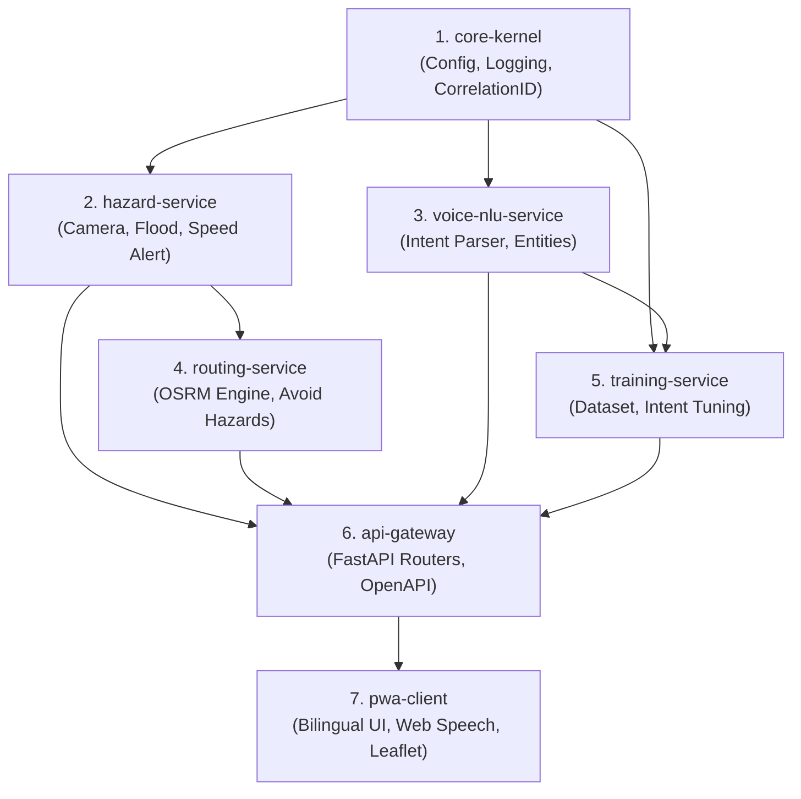
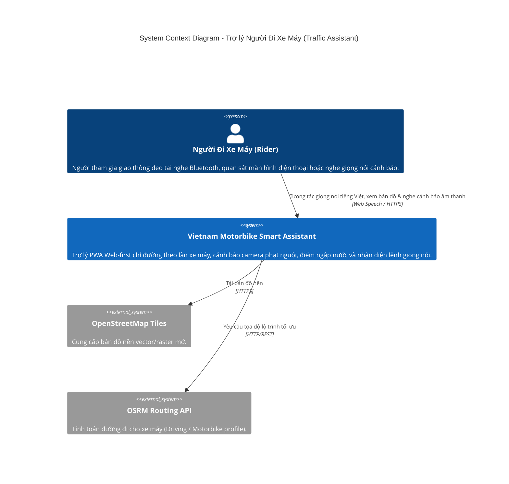
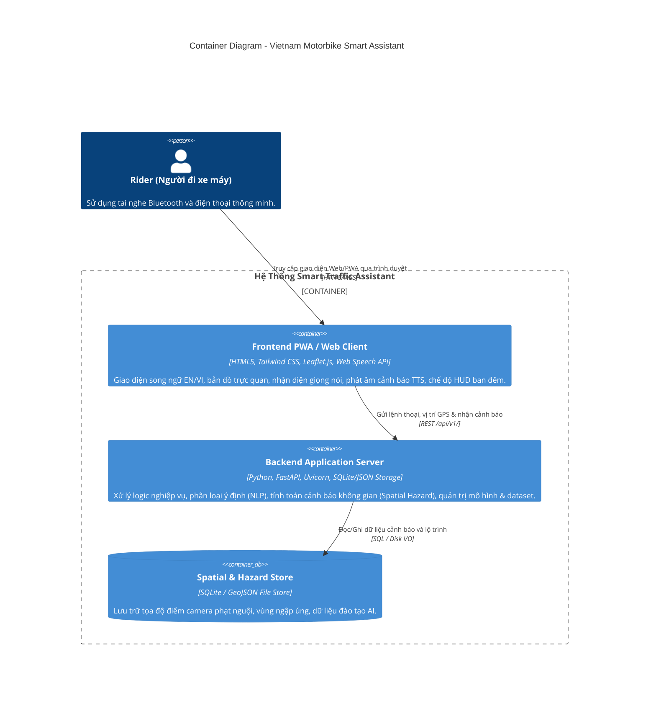
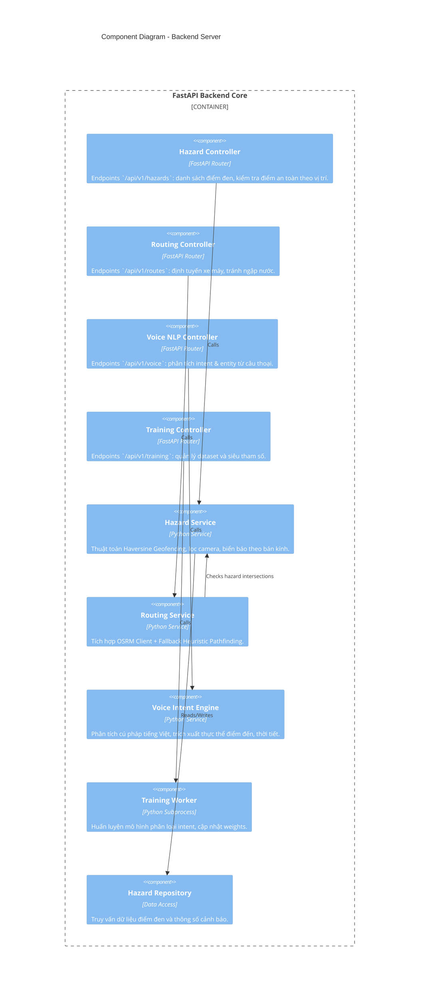
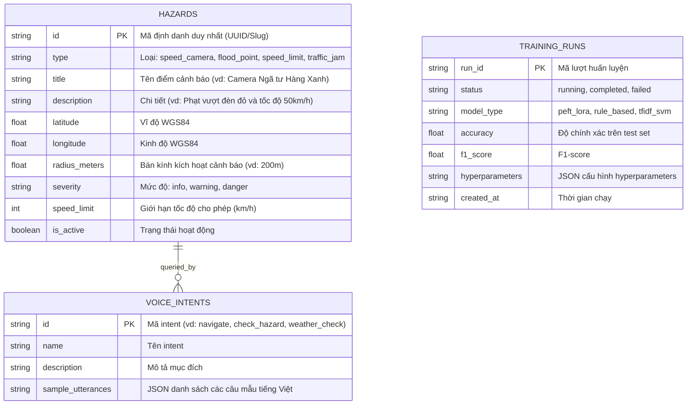

# BẢN ĐẶC TẢ KIẾN TRÚC HỆ THỐNG (SYSTEM ARCHITECTURE SPECIFICATION)
## VIETNAM MOTORBIKE SMART TRAFFIC ASSISTANT

> **Phiên bản:** `1.0.0` | **Tác giả:** Trụ cột 1 - ARCHITECT (Autonomous Closed-Loop Engine)  
> **Trạng thái:** `Đã phê duyệt (Approved)` | **Sprint:** `Sprint 0`

---

## 1. PHẦN 0: BẢN ĐỒ NĂNG LỰC & THỨ TỰ XÂY DỰNG (CAPABILITY MAP & BUILD ORDER)

Hệ thống được module hóa thành các **Capability Module IDs ổn định (kebab-case)**, tuân thủ nguyên tắc phụ thuộc một chiều (Acyclic Dependency Graph), phân tách rõ ràng trách nhiệm.

### 1.1 Danh mục Capability Modules

| Module ID | Tên Module | Trách nhiệm chính | Chiều phụ thuộc |
|:---|:---|:---|:---|
| `core-kernel` | Core Config & Observability | Quản lý biến môi trường, Structured JSON Logger, Correlation ID, Custom Exceptions | Không phụ thuộc |
| `hazard-service` | Hazard & Traffic Safety Alerts | Quản lý điểm đen giao thông (camera phạt nguội, điểm ngập nước, giới hạn tốc độ). Tính toán geofence & khoảng cách cảnh báo (Haversine) | `core-kernel` |
| `routing-service` | Motorbike Route Engine | Tính toán lộ trình xe máy tránh điểm nóng ngập nước/tai nạn qua OSRM (Open Source Routing Machine) | `core-kernel`, `hazard-service` |
| `voice-nlu-service`| Voice Intent & NLP Classifier | Phân loại ý định người dùng (tìm đường, hỏi camera, hỏi thời tiết/ngập úng, báo cáo sự cố) qua Rule-based & LLM fallback | `core-kernel` |
| `training-service` | Model & Dataset Management | Quản lý bộ dữ liệu cảnh báo, huấn luyện/tinh chỉnh mô hình phân loại intent, xuất checkpoint | `core-kernel`, `voice-nlu-service` |
| `api-gateway` | REST API & WebSocket Layer | Cung cấp endpoints `/api/v1/`, OpenAPI contracts, rate-limiting, CORS, health check | Tất cả services trên |
| `pwa-client` | Mobile-first Bilingual UI | Giao diện Web/PWA song ngữ (EN/VI), Web Speech STT/TTS rảnh tay, Leaflet Map, chế độ HUD ban đêm | `api-gateway` |

### 1.2 Thứ tự Xây dựng (Build Order & Dependency Graph)



---

## 2. PHẢN BIỆN ĐỐI KHÁNG QUYẾT ĐỊNH THEN CHỐT (DOUBT-DRIVEN SCRUTINY)

Áp dụng chu trình 5 bước **Doubt Cycle** (`CLAIM` $\rightarrow$ `EXTRACT` $\rightarrow$ `DOUBT` $\rightarrow$ `RECONCILE` $\rightarrow$ `STOP`):

### Cycle 1: Kiến trúc Nhận diện Giọng nói (Client Web Speech vs Server-side Whisper API)
1. **CLAIM:** "Nên truyền trực tiếp luồng Audio Stream từ điện thoại lên Server để chạy Whisper/Speech-to-Text để nhận diện chính xác nhất."
2. **EXTRACT Giả định:** Đường truyền 4G trên đường xe máy luôn ổn định; Server có đủ GPU để xử lý âm thanh thời gian thực với latency < 500ms.
3. **DOUBT (Phản biện):** Khi người đi xe máy di chuyển ở tốc độ 30-50 km/h qua các hầm chui hoặc vùng sóng yếu, upload raw audio sẽ bị drop gói tin, gây nghẽn băng thông và độ trễ vượt quá 2-3 giây (gây tai nạn nếu cảnh báo chậm). Chi phí GPU server cho real-time audio streaming là quá lớn.
4. **RECONCILE:** Sử dụng **Web Speech API tích hợp sẵn trong trình duyệt (Chrome/Safari)** để chuyển giọng nói sang văn bản ngay tại thiết bị (Edge STT), chỉ gửi chuỗi Text Intent nhỏ (< 1KB) về Backend xử lý NLP. Nếu người dùng ngoại tuyến, client vẫn hiển thị transcript.
5. **STOP:** Quyết định được chốt và ghi vào [ADR-003](file:///d:/CODE/traffic-assistant/docs/architecture/adr/ADR-003-voice-assistant-and-nlp-pipeline.md).

### Cycle 2: Dịch vụ Bản đồ & Định tuyến (Google Maps API vs OpenStreetMap + OSRM)
1. **CLAIM:** "Sử dụng Google Maps Directions API để có dữ liệu đường sá và tình trạng tắc đường chính xác nhất."
2. **EXTRACT Giả định:** Dự án có ngân sách thẻ tín dụng trả phí Google Maps; Google Maps hỗ trợ lọc ngập úng và camera phạt nguội chuyên biệt cho xe máy tại Việt Nam.
3. **DOUBT (Phản biện):** Google Maps tính phí $5-$10/1000 requests, dễ bị cạn quota khi người dùng liên tục polling lộ trình. Hơn nữa, Google API không cho phép can thiệp thuật toán tránh điểm ngập nước tùy biến theo dữ liệu cộng đồng địa phương.
4. **RECONCILE:** Sử dụng **OpenStreetMap (Leaflet.js)** và **OSRM (Open Source Routing Machine) Engine** kèm cơ chế thuật toán Geo-Penalty A* nội bộ để chủ động tránh các điểm ngập nước và kẹt xe. Hoàn toàn miễn phí, độc lập hạ tầng, hoạt động ổn định trong Docker.
5. **STOP:** Quyết định được chốt và ghi vào [ADR-002](file:///d:/CODE/traffic-assistant/docs/architecture/adr/ADR-002-geospatial-routing-and-hazard-alerting.md).

### Cycle 3: Phong cách Kiến trúc (Microservices vs Clean Layered Architecture)
1. **CLAIM:** "Tách riêng từng service thành Docker Microservices độc lập (Routing Service, Hazard Service, Voice Service, Gateway)."
2. **EXTRACT Giả định:** Hệ thống cần quy mô hàng triệu người dùng phân tán và đội ngũ hàng chục lập trình viên.
3. **DOUBT (Phản biện):** Với phạm vi MVP và Sprint hiện tại, chia quá nhiều microservice sẽ gây ra Distributed Tracing overhead, latency mạng giữa các container, và khó khăn khi triển khai 1-click `run.bat` trên máy cá nhân/máy chủ đơn lẻ.
4. **RECONCILE:** Chọn **Layered Clean Architecture** trong một Backend Monolith tối ưu hóa bằng FastAPI Async, đóng gói trong 1 container duy nhất nhưng phân chia modules/layers rõ ràng (`domain`, `application`, `infrastructure`, `presentation`). Dễ bảo trì, test thần tốc, sẵn sàng tách nhỏ khi cần.
5. **STOP:** Quyết định được chốt và ghi vào [ADR-001](file:///d:/CODE/traffic-assistant/docs/architecture/adr/ADR-001-architecture-style.md).

---

## 3. THIẾT KẾ KIẾN TRÚC TỔNG THỂ THEO MÔ HÌNH C4 (C4 MODEL)

### 3.1 C4 Level 1: System Context Diagram



### 3.2 C4 Level 2: Container Diagram



### 3.3 C4 Level 3: Component Diagram (Backend API)



---

## 4. THIẾT KẾ CƠ SỞ DỮ LIỆU & LƯỢC ĐỒ (ERD)



---

## 5. CẤU TRÚC THƯ MỤC CHUẨN LAYERED ARCHITECTURE

```
traffic-assistant/
├── run.bat                              # 1-Click Run cho Windows
├── run.sh                               # 1-Click Run cho Linux/macOS
├── docker-compose.yml                   # Docker Compose đa dịch vụ
├── Dockerfile                           # Multi-stage Docker build
├── .env.dev                             # Môi trường phát triển
├── .env.staging                         # Môi trường kiểm thử
├── .env.prod                            # Môi trường sản xuất
├── .env.example                         # Mẫu cấu hình môi trường
├── .gitignore
├── README.md                            # Hướng dẫn khởi chạy & Kiến trúc
├── problem_statement.md                 # Đặc tả bài toán Phase 0 (PRS >= 80%)
├── docs/
│   ├── handoff/
│   │   └── PHASE_HANDOFF_REPORT.md      # Kênh giao tiếp & Handoff chính thức
│   ├── scrum/
│   │   ├── PRODUCT_BACKLOG.md           # Product Backlog chuẩn MoSCoW
│   │   ├── SPRINT_1_BACKLOG.md          # Sprint 1 Backlog & Tasks
│   │   └── SPRINT_1_RETRO.md            # Sprint Retrospective
│   ├── architecture/
│   │   ├── design_spec.md               # Tài liệu này
│   │   ├── openapi.yaml                 # Hợp đồng API OpenAPI 3.0
│   │   └── adr/
│   │       ├── ADR-001-architecture-style.md
│   │       ├── ADR-002-geospatial-routing-and-hazard-alerting.md
│   │       └── ADR-003-voice-assistant-and-nlp-pipeline.md
│   ├── qa/
│   │   ├── qa_loop_log.md
│   │   └── load_test_report.md
│   ├── security/
│   │   └── security_audit_report.md
│   └── operations/
│       └── OPERATIONS_RUNBOOK.md
├── backend/
│   ├── requirements.txt
│   ├── pytest.ini
│   └── src/
│       ├── core/                        # Config, Structured Logger, Security
│       │   ├── config.py
│       │   ├── logger.py
│       │   └── security.py
│       ├── domain/                      # Data Models, Schemas, Entities
│       │   ├── hazard.py
│       │   ├── route.py
│       │   └── voice.py
│       ├── infrastructure/              # Repositories, External APIs, File Store
│       │   ├── hazard_repository.py
│       │   ├── osrm_client.py
│       │   └── seed_data.py
│       ├── application/                 # Use Cases & Business Logic
│       │   ├── hazard_service.py
│       │   ├── routing_service.py
│       │   ├── voice_intent_service.py
│       │   └── training_service.py
│       └── presentation/                # REST Controllers & Health API
│           ├── api_v1.py
│           └── main.py
├── frontend/
│   ├── index.html                       # Giao diện chính PWA
│   ├── locales/
│   │   ├── en.json                      # Từ điển tiếng Anh
│   │   └── vi.json                      # Từ điển tiếng Việt
│   └── static/
│       ├── app.js                       # Logic PWA, Web Speech, Leaflet Map
│       ├── training.html                # Trang Dedicated Model Training
│       ├── training.js                  # Logic trang quản trị huấn luyện
│       ├── styles.css                   # Custom HUD styles & Tailwind
│       └── manifest.json                # PWA manifest
└── tests/
    ├── test_hazard_service.py
    ├── test_routing_service.py
    ├── test_voice_nlp.py
    └── test_api_endpoints.py
```
