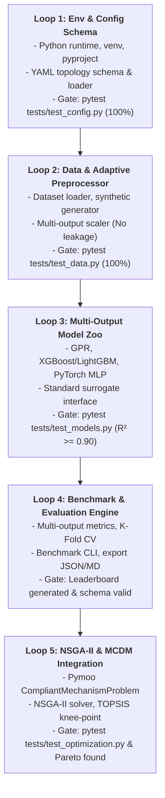

# Implementation Plan: AutoCompliant-ML (5 Autonomous Loops)

> **Mục tiêu**: Xây dựng hệ thống học máy thích ứng theo cấu hình (**Config-driven Machine Learning Pipeline**) và tối ưu hóa tiến hóa đa mục tiêu (**NSGA-II & MCDM**) cho cơ cấu định vị vi mô đàn hồi (*Compliant Mechanisms*).
> 
> **Phương pháp luận**: Triển khai theo chuẩn **Loop Engineering**, chia nhỏ dự án thành **5 vòng lặp tự hành độc lập**. Mỗi vòng lặp có phạm vi tác động hẹp (**Minimal Diff**), bắt buộc vượt qua cổng kiểm soát chất lượng (**Gate verification**) trước khi kích hoạt vòng lặp tiếp theo.

---

## Tổng quan 5 Vòng Lặp Tự Hành (Autonomous Loop Roadmap)

---

## Chi tiết từng Vòng Lặp (Loop Specifications)

### [Loop 1: Env & Config Schema]
- **Mục tiêu**: Khởi tạo nền tảng môi trường Python chuẩn mực và xây dựng module nạp cấu hình cơ cấu đàn hồi dạng khai báo (Config-driven Topology Definition).
- **Phạm vi tác động (Minimal Diff)**:
  - `pyproject.toml` / `requirements.txt`: Khai báo dependencies khoa học tính toán (`numpy`, `scipy`, `pandas`, `scikit-learn`, `xgboost`, `lightgbm`, `torch`, `pymoo`, `pyyaml`, `pytest`).
  - `configs/bridge_amplifier.yaml`: Cấu hình mẫu topology Bridge-type 5 biến thiết kế hình học $(t, w, l, \theta, r)$ và 3 đặc tính cơ học $(F_1, F_2, f)$.
  - `configs/scott_russell.yaml`: Cấu hình mẫu topology Scott-Russell.
  - `autocompliant/config/schema.py`: Pydantic/dataclass schema xác thực dữ liệu đầu vào, miền giá trị bounds, mục tiêu tối ưu, ràng buộc.
  - `autocompliant/config/loader.py`: Đọc YAML, tự động trích xuất metadata $D_{\text{in}}$, $D_{\text{out}}$, bounds $[x_{\min}, x_{\max}]$.
  - `tests/test_config.py`: Unit test kiểm thử tính hợp lệ của schema và loader.
- **Rào chắn kiểm thử (Gate 1)**:
  - Lệnh kiểm tra: `pytest tests/test_config.py -v`
  - Tiêu chí nghiệm thu: **100% passed**, phát hiện đúng lỗi khi cấu hình sai bounds ($x_{\min} \ge x_{\max}$) hoặc thiếu trường dữ liệu bắt buộc.
  - Loop Safety Gate: `tools\loop-gate.cmd check --action commit --paths "configs/**,autocompliant/config/**"` $\rightarrow$ `ALLOWED [ok]`.

---

### [Loop 2: Data & Adaptive Preprocessor]
- **Mục tiêu**: Xây dựng pipeline dữ liệu thích ứng với $D_{\text{in}}, D_{\text{out}}$ bất kỳ từ config, đảm bảo triệt để nguyên tắc không rò rỉ thông tin (**No Data Leakage**).
- **Phạm vi tác động (Minimal Diff)**:
  - `autocompliant/data/dataset.py`: Loader đọc file CSV/Parquet theo danh sách cột được khai báo trong config.
  - `autocompliant/data/preprocessor.py`: Lớp biến đổi co giãn đặc trưng (`AdaptivePreprocessor`) hỗ trợ Standard/MinMax scaling riêng biệt cho $X$ và ma trận đa đầu ra $Y$, hỗ trợ `inverse_transform_y`.
  - `autocompliant/data/synthetic_generator.py`: Bộ sinh dữ liệu tổng hợp dựa trên phương trình cơ học giải tích cơ cấu khuếch đại bản lề mềm (Compliance Matrix Method) để phục vụ phát triển độc lập không phụ thuộc file FEA.
  - `tests/test_data.py`: Unit test kiểm thử pipeline dữ liệu.
- **Rào chắn kiểm thử (Gate 2)**:
  - Lệnh kiểm tra: `pytest tests/test_data.py -v`
  - Tiêu chí nghiệm thu:
    - **100% passed**.
    - Chứng minh **No Leakage**: Scaler chỉ được fit trên tập Train; tập Test/Validation chỉ dùng transform.
    - Sai số phục hồi phép biến đổi ngược `inverse_transform_y(transform_y(Y))` có độ lệch tuyệt đối $< 10^{-6}$.

---

### [Loop 3: Multi-Output Model Zoo]
- **Mục tiêu**: Xây dựng tập hợp các mô hình hồi quy thay thế (Surrogate Models) đa đầu ra, kế thừa từ một giao diện đồng nhất (`BaseSurrogateModel`).
- **Phạm vi tác động (Minimal Diff)**:
  - `autocompliant/models/base.py`: Interface định nghĩa phương thức `fit(X, Y)`, `predict(X)`, `predict_with_uncertainty(X)`, `save(path)`, `load(path)`.
  - `autocompliant/models/gpr_model.py`: Gaussian Process Regressor đa đầu ra với kernel Matern/RBF, hỗ trợ trích xuất độ bất định $\sigma(X)$.
  - `autocompliant/models/gbm_model.py`: XGBoost và LightGBM Multi-Output wrapper.
  - `autocompliant/models/dnn_model.py`: PyTorch Adaptive Tabular MLP tự động sinh kích thước tầng vào $\mathbb{R}^{D_{\text{in}}}$ và tầng ra $\mathbb{R}^{D_{\text{out}}}$ theo config.
  - `autocompliant/models/baseline_models.py`: Polynomial Response Surface (RSM) và Random Forest.
  - `tests/test_models.py`: Unit test kiểm tra huấn luyện và suy luận cho tất cả các mô hình.
- **Rào chắn kiểm thử (Gate 3)**:
  - Lệnh kiểm tra: `pytest tests/test_models.py -v`
  - Tiêu chí nghiệm thu:
    - **100% passed**.
    - Kích thước tensor/mảng dự đoán chính xác $[N, D_{\text{out}}]$.
    - Mô hình baseline & surrogate đạt hệ số xác định trung bình $R^2 \ge 0.90$ trên tập test của dữ liệu chuẩn.

---

### [Loop 4: Benchmark & Evaluation Engine]
- **Mục tiêu**: Xây dựng công cụ so chuẩn tự động (Benchmarking Engine) đánh giá độ chính xác, tốc độ suy luận (latency) và xuất báo cáo xếp hạng Leaderboard chuẩn hóa.
- **Phạm vi tác động (Minimal Diff)**:
  - `autocompliant/evaluation/metrics.py`: Tính toán $R^2$, RMSE, MAE, MAPE per-output và mean across outputs.
  - `autocompliant/evaluation/benchmark.py`: Bộ thực thi K-Fold Cross Validation trên toàn bộ Model Zoo, đo thời gian huấn luyện và thời gian suy luận (latency trên từng mẫu tính bằng ms).
  - `run_benchmark.py`: CLI script chạy quy trình benchmark và tự động lưu mô hình có hiệu năng cao nhất (`best_surrogate.pkl`).
  - `tests/test_benchmark.py`: Test kiểm tra format báo cáo và schema xuất ra.
- **Rào chắn kiểm thử (Gate 4)**:
  - Lệnh kiểm tra: `python run_benchmark.py --config configs/bridge_amplifier.yaml --samples 500 --export-leaderboard`
  - Tiêu chí nghiệm thu:
    - Tạo thành công tệp `reports/leaderboard.json` và `reports/leaderboard.md`.
    - Cấu trúc file JSON tuân thủ đầy đủ schema: trường `model_name`, `metrics` ($R^2, \text{RMSE}, \text{MAE}$ cho từng mục tiêu), `inference_latency_ms`, `rank`.
    - Tự động serialize và lưu trữ thành công artifact `models/artifacts/best_surrogate.pkl`.

---

### [Loop 5: NSGA-II & MCDM Integration]
- **Mục tiêu**: Tích hợp mô hình surrogate tối ưu làm hàm đánh giá hộp đen (black-box evaluator) cho giải thuật tiến hóa đa mục tiêu NSGA-II và thuật toán chọn nghiệm thỏa hiệp TOPSIS.
- **Phạm vi tác động (Minimal Diff)**:
  - `autocompliant/optimization/problem.py`: Lớp `CompliantMechanismProblem` kế thừa từ `pymoo.core.problem.Problem`, tự động cấu hình $n_{\text{var}}$, $n_{\text{obj}}$, $n_{\text{constr}}$ dựa trên topology YAML.
  - `autocompliant/optimization/nsga2_solver.py`: Bộ giải NSGA-II tích hợp pymoo, hỗ trợ đánh giá quần thể theo lô (batch evaluation) siêu tốc.
  - `autocompliant/optimization/mcdm.py`: Thuật toán TOPSIS (*Technique for Order Preference by Similarity to Ideal Solution*) và phân tích Knee-point nhằm tìm nghiệm thiết kế tối ưu thực tế từ tập Pareto.
  - `run_optimization.py`: CLI script thực thi tối ưu hóa, xuất tập nghiệm `pareto_front.csv` và tọa độ thiết kế tối ưu đề xuất.
  - `tests/test_optimization.py`: Unit test kiểm tra tích hợp NSGA-II và tính hợp lệ của biên Pareto.
- **Rào chắn kiểm thử (Gate 5)**:
  - Lệnh kiểm tra: `pytest tests/test_optimization.py -v`
  - Tiêu chí nghiệm thu:
    - **100% passed**.
    - Tìm được tối thiểu 20 nghiệm không bị trội (non-dominated Pareto solutions) thỏa mãn 100% ràng buộc tĩnh $F_1 \ge 1.5$.
    - Thời gian chạy tối ưu hóa toàn bộ 100 thế hệ (pop=100) qua surrogate model $< 5$ giây (thay vì hàng giờ FEA).
    - Hàm TOPSIS xác định thành công điểm thiết kế thỏa hiệp duy nhất tốt nhất.

---

## Ma trận Cổng Kiểm Soát (Gate Verification Matrix)

| Vòng lặp | File Gate Kiểm Thử | Lệnh Kiểm Thử Tự Động | Tiêu Chí Vượt Rào (Acceptance Criteria) |
| :--- | :--- | :--- | :--- |
| **Loop 1** | `tests/test_config.py` | `pytest tests/test_config.py` | Schema YAML hợp lệ, trích xuất chính xác $D_{\text{in}}, D_{\text{out}}$, bounds |
| **Loop 2** | `tests/test_data.py` | `pytest tests/test_data.py` | No data leakage, `inverse_transform` sai số $< 10^{-6}$ |
| **Loop 3** | `tests/test_models.py` | `pytest tests/test_models.py` | Shape $[N, D_{\text{out}}]$, trung bình $R^2 \ge 0.90$ trên synthetic set |
| **Loop 4** | CLI / Benchmark | `python run_benchmark.py --check` | Xuất `leaderboard.json` & `leaderboard.md`, lưu `best_surrogate.pkl` |
| **Loop 5** | `tests/test_optimization.py` | `pytest tests/test_optimization.py` | Tập Pareto hợp lệ, ràng buộc $F_1 \ge 1.5$, TOPSIS Knee-point |

---

## Kế hoạch Cập nhật Trạng thái Loop (`loop/STATE.md`)

Trước khi bắt tay vào từng Loop, Agent bắt buộc:
1. Đọc [loop/LOOP.md](file:///d:/CODE/AutoCompliant-ML/loop/LOOP.md) và [loop/STATE.md](file:///d:/CODE/AutoCompliant-ML/loop/STATE.md).
2. Thiết lập mục tiêu của Loop hiện tại.
3. Chạy lệnh gate tương ứng sau khi viết code.
4. Ghi log kết quả vào [loop/loop-run-log.md](file:///d:/CODE/AutoCompliant-ML/loop/loop-run-log.md) và chuyển trạng thái chu kỳ trong [loop/STATE.md](file:///d:/CODE/AutoCompliant-ML/loop/STATE.md).
