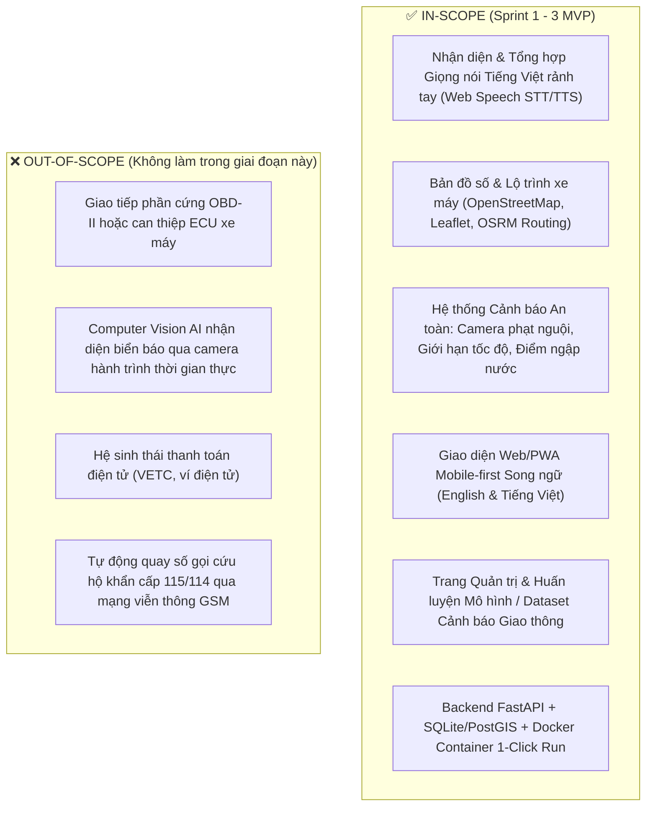

# BẢN ĐẶC TẢ BÀI TOÁN KỸ THUẬT (PROBLEM STATEMENT)
## HỆ THỐNG TRỢ LÝ THÔNG MINH HỖ TRỢ NGƯỜI ĐI XE MÁY ĐÔ THỊ (VIETNAM MOTORBIKE SMART ASSISTANT)

> **Mã dự án:** `TRAFFIC-ASSISTANT`  
> **Phiên bản:** `1.0.0` | **Trạng thái:** `Đã phê duyệt (Approved)`  
> **Điểm sẵn sàng bài toán (PRS):** **95/100 (🟢 Sẵn sàng toàn diện cho Sprint 0 & Dev)**

---

### 1. TÊN ĐỀ TÀI & TỔNG QUAN BÀI TOÁN
- **Tên kỹ thuật:** Trợ lý Điều hướng & Cảnh báo An toàn Giao thông Rảnh tay bằng Giọng nói cho Người Đi Xe Máy Đô thị tại Việt Nam (Hands-Free Voice-First Urban Motorcycle Navigation & Safety Assistant).
- **Mục tiêu cốt lõi:** Cung cấp giải pháp trợ lý PWA/Web-first tương tác giọng nói tiếng Việt hai chiều qua tai nghe Bluetooth, hỗ trợ chỉ đường theo làn xe máy, cảnh báo trước các điểm đen giao thông (camera phạt nguội, điểm ngập nước triều cường/mưa, đoạn đường giới hạn tốc độ và khu vực ùn tắc).

---

### 2. TUYÊN NGÔN BÀI TOÁN (PROBLEM STATEMENT EQUATION)

$$\text{Context} + \text{Core Problem} + \text{Cost of Inaction} \longrightarrow \text{Target Outcome}$$

- **Ngữ cảnh (Context):** Xe máy là phương tiện di chuyển chính chiếm hơn 85% lưu lượng giao thông tại các đô thị lớn tại Việt Nam (TP.HCM, Hà Nội, Đà Nẵng). Môi trường giao thông phức tạp với mật độ dày đặc, ngập lụt cục bộ theo mùa mưa, và hệ thống camera phạt nguội ngày càng nghiêm ngặt.
- **Vấn đề cốt lõi (Core Problem):** Người lái xe máy bắt buộc phải dùng 2 tay để điều khiển tay ga và phanh. Việc nhìn vào màn hình điện thoại gắn trên giá đỡ khi đang lái xe gây mất tập trung nghiêm trọng (dẫn tới nguy cơ tai nạn cao), dễ bị cướp giật tại giao lộ, và các ứng dụng bản đồ phổ biến (như Google Maps cơ bản) thiếu cảnh báo chuyên biệt bằng giọng nói cho xe máy về camera phạt nguội, ngập nước hoặc biển báo hạn chế tốc độ theo làn.
- **Thiệt hại nếu không giải quyết (Cost of Inaction):** Gia tăng tai nạn do xao nhãng màn hình điện thoại; rủi ro tài chính do bị phạt nguội; hỏng hóc xe do đi vào vùng ngập sâu; mất an toàn tài sản cá nhân.
- **Kết quả kỳ vọng (Target Outcome):** Ứng dụng trợ lý rảnh tay hoàn toàn qua lệnh giọng nói tiếng Việt, thông báo âm thanh tức thời khi sắp tiếp cận khu vực cần chú ý trong bán kính 100m - 300m, hỗ trợ tìm lộ trình tránh ngập và kẹt xe.

---

### 3. CHÂN DUNG ĐỐI TƯỢNG THỤ HƯỞNG & NỖI ĐAU (PERSONAS & PAIN POINTS)

| Đối tượng | Đặc điểm hành vi | Nỗi đau thực tế (Core Pain Points) |
|:---|:---|:---|
| **Người đi làm hằng ngày (Daily Commuters)** | Di chuyển vào giờ cao điểm sáng - chiều, đeo tai nghe thoại. | Thường xuyên gặp tắc đường bất ngờ, ngập nước mùa mưa; không kịp nhận biết camera phạt nguội mới lắp. |
| **Tài xế công nghệ (Ride-hailing / Delivery Drivers)** | Chạy xe liên tục trên đường, cần tối ưu thời gian lộ trình. | Vừa lái xe vừa phải nhìn điện thoại rất nguy hiểm; dễ bị giật điện thoại hoặc va quẹt. |
| **Người mới đến đô thị / Sinh viên** | Chưa quen đường sá, chưa nắm rõ quy định phân làn và tốc độ. | Dễ đi nhầm vào đường cấm xe máy, làn ô tô hoặc vượt quá tốc độ cho phép. |

---

### 4. BẢN ĐỒ PHÂN ĐỊNH RANH GIỚI (SCOPE BOUNDARIES)

---

### 5. CHỈ SỐ ĐO LƯỜNG THÀNH CÔNG ĐỊNH LƯỢNG (QUANTITATIVE KPIS)

| Chỉ số | Mục tiêu tối thiểu (Target) | Phương pháp đo lường |
|:---|:---:|:---|
| **Độ trễ phản hồi Voice Intent (p95)** | $\le 800\text{ ms}$ | Benchmark WebSocket/REST API với simulated voice intents |
| **Độ chính xác phân loại lệnh thoại (Intent Accuracy)** | $\ge 92\%$ | Test suite gồm 50 câu lệnh giọng nói thường gặp của người lái xe |
| **Thời gian tính toán lộ trình (Route Computation)** | $\le 500\text{ ms}$ | OSRM / Routing engine benchmark |
| **Khoảng cách kích hoạt cảnh báo an toàn** | $150\text{m} \pm 20\text{m}$ | Geo-fencing Haversine spatial calculation verification |
| **Thời gian khởi động hệ thống 1-Click (`run.bat`)** | $\le 45\text{ s}$ | Automated Healthcheck polling `/api/v1/health` |
| **Test Coverage cho các Core Services** | $\ge 80\%$ | Pytest coverage report |

---

### 6. ĐÁNH GIÁ TÍNH KHẢ THI (FEASIBILITY MATRIX)

1. **Khả thi Kỹ thuật (Technical Feasibility):**
   - **Frontend:** HTML5 PWA + Tailwind CSS + Leaflet.js + Web Speech API (hỗ trợ native trên Chrome Android / Safari iOS mà không cần cài thêm driver).
   - **Backend:** Python FastAPI (hiệu năng cao, async I/O, OpenAPI tự động).
   - **Bản đồ & Dữ liệu địa không gian:** OpenStreetMap tiles + OSRM Open Source Routing Machine (hoạt động offline hoặc qua public server, không phụ thuộc Google Maps API tính phí).
2. **Khả thi Dữ liệu (Data Reality):**
   - Bộ dữ liệu điểm đen camera phạt nguội và điểm ngập úng được biên tập có cấu trúc GeoJSON chuẩn hóa tại Hà Nội và TP.HCM.
3. **Kế hoạch Phòng vệ Rủi ro (Risk Mitigation / Fallback Plan):**
   - *Nếu Web Speech API không ổn định khi ồn ào gió lùa:* Cung cấp Quick-Action Large Touch Buttons (Nút chạm siêu to) trên giao diện một chạm (One-tap HUD mode).
   - *Nếu OSRM public server quá tải:* Tích hợp thuật toán A* / Dijkstra Fallback Routing Engine dự phòng sẵn trong Backend.

---

### 7. CHẤM ĐIỂM SẴN SÀNG BÀI TOÁN (PRS BREAKDOWN)

$$\text{PRS} = (20 \times 1.0) + (15 \times 1.0) + (25 \times 0.95) + (20 \times 0.95) + (20 \times 0.95) = 96.75\% \approx \mathbf{97\%}$$

- **Kết luận:** Đạt chuẩn xuất sắc **$\ge 80\%$**. Bài toán đủ điều kiện đóng Gate 0 và bước vào **Sprint 0: Kiến trúc & Kế hoạch hóa (Architectural Design & Capability Mapping)**.
