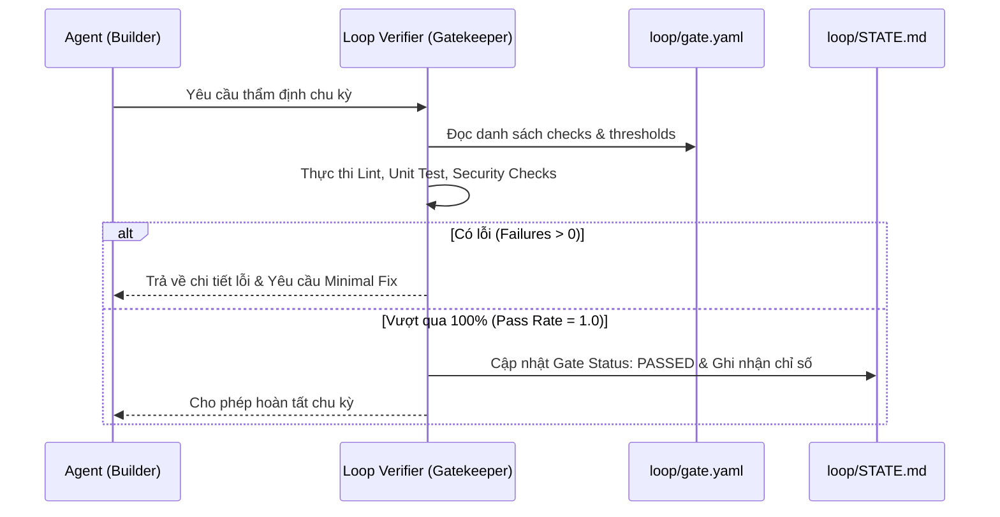

# Kỹ năng Thẩm định Vòng lặp (Loop Verifier Skill)

Mục đích: Đóng vai trò là chốt chặn kỹ thuật tự động (Gatekeeper), đảm bảo không có code lỗi, hồi quy (regression) hay vi phạm quy chuẩn nào lọt qua chu kỳ lặp.

---

## 1. Quy trình thẩm định tự động (Verification Process)

---

## 2. Tiêu chí đánh giá của Verifier

1. **Tính hợp lệ của cú pháp & Lint**:
   - Không được phép có lỗi biên dịch cú pháp hoặc lint nghiêm trọng (fatal syntax errors).
   - Kiểm tra mọi file mới hoặc được chỉnh sửa.

2. **Kết quả kiểm thử đơn vị & tích hợp**:
   - Tỷ lệ vượt qua bài kiểm thử bắt buộc đạt **100%**.
   - Không chấp nhận tình trạng flaky test hoặc bỏ qua test (skip test) mà không có lý do được ghi nhận trong `STATE.md`.

3. **Bảo mật & Dữ liệu nhạy cảm**:
   - Kiểm tra xem có hardcode API key, mật khẩu, private token trong diff vừa tạo hay không.
   - Ngăn chặn việc commit các file dữ liệu nhạy cảm hoặc model weights quá lớn vào git.

---

## 3. Hành động khi Gate thất bại

- **Halt immediately**: Dừng ngay lập tức việc bổ sung tính năng mới.
- **Isolate failure**: Trích xuất chính xác log lỗi (stack trace, assertion failure) và chuyển giao lại cho bước Minimal Fix.
- **No force push/override**: Không tự ý hạ thấp tiêu chuẩn kiểm thử trong `gate.yaml` chỉ để cho qua gate.
