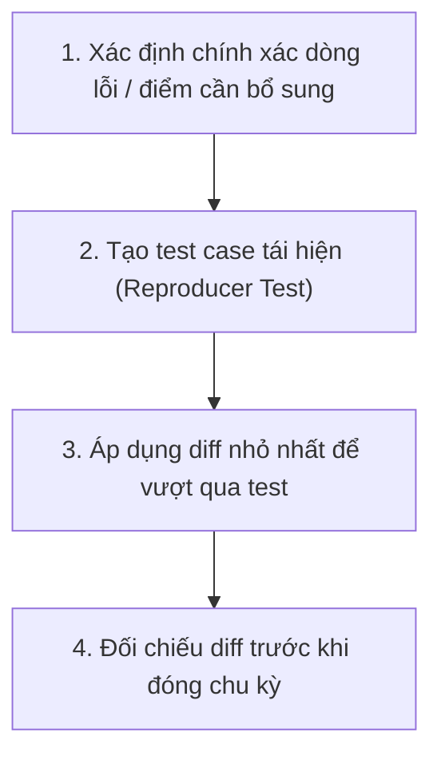

# Kỹ năng Sửa đổi Tối thiểu (Minimal Fix Skill)

Mục đích: Đảm bảo mọi chu kỳ can thiệp code chỉ thực hiện những thay đổi nhỏ nhất, an toàn nhất để hoàn thành mục tiêu, giảm thiểu tối đa rủi ro gây lỗi liên đới (side-effects).

---

## 1. Nguyên tắc cốt lõi (Core Tenets)

1. **Phạm vi tác động hẹp (Minimal Blast Radius)**:
   - Một chu kỳ chỉ tập trung giải quyết 01 vấn đề duy nhất.
   - Không sửa quá 3-5 file trong một chu kỳ lặp trừ khi được yêu cầu rõ ràng.

2. **Bảo toàn ngữ cảnh (Context Preservation)**:
   - Giữ nguyên toàn bộ comment giải thích, docstring và quy ước đặt tên hiện có.
   - Không tự ý format lại toàn bộ file nếu không liên quan tới đoạn code được sửa.

3. **Không lập trình suy đoán (No Speculative Coding)**:
   - Không tự ý thêm tính năng tương lai ("future-proofing") khi chưa có trong mục tiêu của chu kỳ.
   - Không tự tiện xóa bỏ các hàm helper, interface cũ mà các module khác có thể đang phụ thuộc.

---

## 2. Quy trình 4 bước thực hiện Minimal Fix

### Bước 1: Khoanh vùng lỗi / tính năng
- Sử dụng công cụ đọc code để xác định chính xác vị trí hàm hoặc biến số gây ra vấn đề.
- Không chỉnh sửa các module lân cận nếu vấn đề có thể giải quyết cục bộ.

### Bước 2: Thiết kế bài kiểm tra mục tiêu
- Viết hoặc xác định một bài test tập trung (focused test) phản ánh trực tiếp hành vi mong muốn.
- Chạy test trước để chắc chắn test bắt được lỗi/kỳ vọng.

### Bước 3: Áp dụng thay đổi
- Sử dụng phương thức thay thế vùng chọn hẹp (`replace_file_content`) thay vì ghi đè toàn bộ tệp tin (`write_to_file`) khi có thể.
- Kiểm tra tính tương thích ngược (backward compatibility).

### Bước 4: Review lại Diff
- Tự vấn trước khi kết thúc: *"Có dòng code nào trong diff này không trực tiếp phục vụ mục tiêu chu kỳ không?"*
- Nếu có, hãy loại bỏ ngay lập tức.
